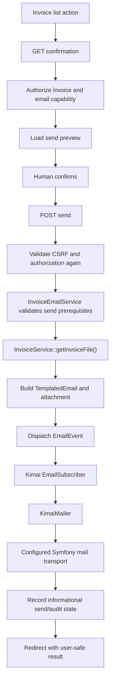

# Architecture

## Purpose

This document defines the intended architecture for the first maintained
version of the Kimai Invoice Emailer plugin.

The first release is intentionally narrow.  It provides a human-initiated,
secured workflow for sending an already-generated Kimai invoice to the email
address associated with that invoice's customer.

Automatic sending, automatic invoice status transitions, additional recipients,
and queued/outbox delivery are outside this architecture unless a later
accepted ADR introduces them.

## Architectural Baseline

The first implementation target is Kimai 2.67.0.

Source review of Kimai 2.67.0 confirms the integration points used by this
design:

- `InvoiceService::getInvoiceFile(Invoice)` returns the stored invoice file;
- `EmailEvent` wraps a Symfony `Email`;
- Kimai's `EmailSubscriber` handles `EmailEvent`;
- `EmailSubscriber` delegates delivery to `KimaiMailer`;
- `KimaiMailer` delegates to the configured Symfony mail transport and can
  supply Kimai's configured fallback sender; and
- Kimai's action-subscriber framework remains available through
  `AbstractActionsSubscriber`.

The deprecated `ServiceInvoice` compatibility class must not be used by new
plugin code.  Kimai 2.67.0 marks it deprecated since 2.56 and directs callers
to `InvoiceService`.

## Architectural Goal

The plugin should make the consequential boundary obvious:

> an authorized human reviews a specific invoice-email operation and explicitly
> submits it.

The controller owns HTTP concerns.  The application service owns send
preconditions and message construction.  Kimai owns invoice-file resolution,
mail configuration, and transport dispatch.

## Request and Delivery Flow



## Components

### Invoice action subscriber

The action subscriber exposes the email action from the invoice-list UI.

Its responsibilities are limited to deciding whether an action should be shown
and producing the URL for the confirmation endpoint.  It must not send email,
modify invoice state, or contain message-building policy.

The action should be hidden for canceled invoices and should be visible only
when the current user has the required capability to begin the workflow.

### Confirmation controller

The GET endpoint is observational.  It performs authorization and prepares a
confirmation view, but it must not:

- send email;
- modify invoice metadata;
- modify invoice status; or
- create another externally visible side effect.

The confirmation view should present enough context for deliberate approval,
including:

- invoice number;
- customer;
- recipient;
- sender identity when known;
- subject; and
- attachment filename.

### Send controller

The POST endpoint is the only HTTP entry point that may initiate the email
side effect.

Before invoking the send service it must establish:

- authenticated user context;
- the dedicated `email_invoice` permission;
- `view_invoice` authorization for the specific invoice;
- applicable object/customer access authorization; and
- a valid CSRF token bound to the send operation.

Authorization and CSRF must be re-evaluated on POST even when the immediately
preceding confirmation GET succeeded.

### InvoiceEmailService

The application service owns send-specific validation and message construction.

It should validate at least:

- the invoice is not canceled;
- a usable customer recipient exists;
- the stored invoice document exists and is readable; and
- message construction can proceed using current Kimai configuration.

The service should obtain the attachment through
`InvoiceService::getInvoiceFile()`.  It must not construct a filesystem path
from request-controlled values.

The service should build a Symfony `TemplatedEmail` and dispatch it through
Kimai's `EmailEvent` rather than bypassing Kimai's email integration.

### Kimai mail boundary

The plugin delegates the final mail operation to Kimai:

```text
Plugin
  -> EmailEvent
  -> Kimai EmailSubscriber
  -> KimaiMailer
  -> configured Symfony transport
```

The plugin should not duplicate Kimai's transport configuration or claim
delivery semantics that the configured transport does not provide.

## Message Policy

The first maintained email body should be deliberately sparse and
locale-neutral.

It may identify the invoice number and state that the invoice is attached.
It should not reproduce totals, dates, currency-formatted values, or branding
assets unless those values are rendered through a verified locale-safe
mechanism.

This avoids carrying forward the upstream behavior that could combine a dollar
symbol with a non-USD currency and avoids relying on branding URLs that may not
be meaningful outside the Kimai application.

## Sender Policy

Prefer Kimai's mail configuration and fallback behavior.

The plugin should not construct an invalid explicit sender when Kimai has no
configured From address.  When no explicit sender is required by the message,
allow `KimaiMailer` to apply Kimai's configured fallback.

## Audit State

The first release may retain an invoice metadata value such as
`email_sent_date` as informational audit state.

That value is not proof that a recipient received the invoice and is not an
exactly-once or idempotency guarantee.  Manual resend remains an explicit,
human-confirmed operation.

If the audit value becomes part of future duplicate-prevention or automatic
behavior, its authority, editability, persistence semantics, and failure model
must be reconsidered through a later architectural decision.

## Failure Model

SMTP or another configured mail transport and Kimai's database do not
participate in one atomic transaction.

A transport may accept a message and the subsequent audit-state persistence may
still fail.  The plugin must surface that uncertainty and must not claim
exactly-once delivery.

The initial manual workflow mitigates this with:

- explicit human confirmation;
- no automatic retry;
- no automatic sending;
- clear operational logging without unnecessary recipient disclosure; and
- visible audit state whose limitations are documented.

A stronger delivery guarantee would require a different architecture, such as
an outbox or durable queue with explicit idempotency semantics.

## Architectural Invariants

The first maintained release must preserve these invariants:

1. GET does not send email.
2. Email submission occurs only through POST.
3. POST requires CSRF validation.
4. The user must have `email_invoice`.
5. The user must be authorized to view the specific invoice.
6. Applicable customer/object authorization must also succeed.
7. The attachment is the stored Kimai invoice returned by `InvoiceService`.
8. Canceled invoices are not sent.
9. The plugin dispatches through Kimai's `EmailEvent`.
10. Manual sending does not automatically change invoice status.
11. No automatic-send event subscriber is part of the first release.
12. "Sent" or "accepted by the configured mail transport" must not be described
    as confirmed recipient delivery.

## Deliberate Non-Goals

The first release does not provide:

- automatic sending on invoice creation;
- automatic sending on invoice status updates;
- `New -> Pending` transitions;
- post-send `PAID` transitions;
- arbitrary additional recipients;
- bulk sending;
- automatic retry;
- queue/outbox delivery;
- delivery receipts; or
- support claims for untested Kimai releases.

## Future Automation

Kimai 2.67.0 provides `InvoiceUpdatePostEvent`, which is documented as firing
after both new and updated invoices are saved.  It is a plausible future
integration point, but it is not part of the first release.

Any later automatic-send feature requires a separate ADR covering at least:

- creation versus update semantics;
- recursion;
- idempotency;
- persistence authority;
- retries;
- mail-versus-database failure ordering; and
- the interaction between manual resend and automatic behavior.

## Related Documents

- [ADR-003](adr/ADR-003-secured-manual-invoice-email-workflow.md)
- [Security](security.md)
- [Compatibility](compatibility.md)
- [Upstream Provenance](../UPSTREAM.md)
