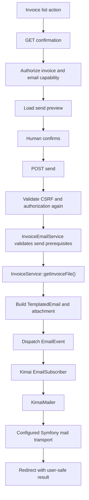

# Architecture

## Purpose

This document defines the intended architecture for the first maintained
version of the Kimai Invoice Emailer plugin.

The first release is intentionally narrow.  It provides a human-initiated,
secured workflow for sending an already-generated Kimai invoice to the email
address associated with that invoice's customer.

ADR-005 extends this architecture with opt-in creation-time automatic sending.
Automatic sending on ordinary updates, automatic invoice status transitions,
additional recipients, retries, and queued/outbox delivery remain outside the
accepted architecture unless a later ADR introduces them.

## Architectural Baseline

The first implementation target is Kimai 2.67.0.

Source review of Kimai 2.67.0 confirms the integration points used by this
design:

- `InvoiceService::getInvoiceFile(Invoice)` returns the stored invoice file;
- `EmailEvent` wraps a Symfony `Email`;
- Kimai's `EmailSubscriber` handles `EmailEvent`;
- `EmailSubscriber` delegates delivery to `KimaiMailer`;
- `KimaiMailer` delegates to the configured Symfony mail transport and can
  supply Kimai's configured fallback sender; and
- Kimai's action-subscriber framework remains available through
  `AbstractActionsSubscriber`.

The deprecated `ServiceInvoice` compatibility class must not be used by new
plugin code.  Kimai 2.67.0 marks it deprecated since 2.56 and directs callers
to `InvoiceService`.

## Architectural Goal

The plugin keeps two consequential boundaries explicit:

> manual sending is reviewed and explicitly submitted by an authorized human;

> automatic sending occurs only after explicit deployment opt-in and only when
> an authenticated authorized user creates a new invoice.

The controller owns manual HTTP concerns.  The automatic policy service owns
creation-event eligibility and failure containment.  The shared application
service owns send preconditions and message construction.  Kimai owns
invoice-file resolution, mail configuration, and transport dispatch.

## Request and Delivery Flow



## Components

### Invoice action subscriber

The action subscriber exposes the email action from the invoice-list UI.

Its responsibilities are limited to deciding whether an action should be shown
and producing the URL for the confirmation endpoint.  It must not send email,
modify invoice state, or contain message-building policy.

The action should be hidden for canceled invoices and should be visible only
when the current user has the required capability to begin the workflow.

### Confirmation controller

The GET endpoint is observational.  It performs authorization and prepares a
confirmation view, but it must not:

- send email;
- modify invoice metadata;
- modify invoice status; or
- create another externally visible side effect.

The confirmation view should present enough context for deliberate approval,
including:

- invoice number;
- customer;
- recipient;
- sender identity when known;
- subject; and
- attachment filename.

### Send controller

The POST endpoint is the only HTTP entry point that may initiate the email
side effect.

Before invoking the send service it must establish:

- authenticated user context;
- the dedicated `email_invoice` permission;
- `view_invoice` authorization for the specific invoice;
- applicable object/customer access authorization; and
- a valid CSRF token bound to the send operation.

Authorization and CSRF must be re-evaluated on POST even when the immediately
preceding confirmation GET succeeded.

### InvoiceEmailService

The application service owns send-specific validation and message construction.

It should validate at least:

- the invoice is not canceled;
- a usable customer recipient exists;
- the stored invoice document exists and is readable; and
- message construction can proceed using current Kimai configuration.

The service should obtain the attachment through
`InvoiceService::getInvoiceFile()`.  It must not construct a filesystem path
from request-controlled values.

The service should build a Symfony `TemplatedEmail` and dispatch it through
Kimai's `EmailEvent` rather than bypassing Kimai's email integration.

### Automatic creation subscriber

When `INVOICE_EMAILER_AUTO_SEND=1`, the automatic subscriber observes only
Kimai's `InvoiceCreatedEvent`.  It does not subscribe to
`InvoiceUpdatePostEvent`, so ordinary edits and status updates cannot become
implicit resend triggers.

The automatic policy requires a current authenticated Kimai user and reuses the
same `email_invoice`, specific-invoice `view_invoice`, and customer-access
authorization boundaries as the manual workflow.  It delegates message
construction and dispatch to `InvoiceEmailService`.

Automatic failures are contained and logged after invoice persistence.  They
are not rethrown through the creation event, do not change invoice status, and
do not retry automatically.  Manual send remains the recovery path.

### Kimai mail boundary

The plugin delegates the final mail operation to Kimai:

```text
Plugin
  -> EmailEvent
  -> Kimai EmailSubscriber
  -> KimaiMailer
  -> configured Symfony transport
```

The plugin should not duplicate Kimai's transport configuration or claim
delivery semantics that the configured transport does not provide.

## Message Policy

The first maintained email body should be deliberately sparse and
locale-neutral.

It may identify the invoice number and state that the invoice is attached.
It should not reproduce totals, dates, currency-formatted values, or branding
assets unless those values are rendered through a verified locale-safe
mechanism.

This avoids carrying forward the upstream behavior that could combine a dollar
symbol with a non-USD currency and avoids relying on branding URLs that may not
be meaningful outside the Kimai application.

## Sender Policy

Prefer Kimai's mail configuration and fallback behavior.

The plugin should not construct an invalid explicit sender when Kimai has no
configured From address.  When no explicit sender is required by the message,
allow `KimaiMailer` to apply Kimai's configured fallback.

## Audit State

The Phase 3 implementation does not persist `email_sent_date` or equivalent
post-send invoice metadata.

Manual resend remains an explicit, human-confirmed operation.  This avoids
presenting a local timestamp as delivery evidence and removes a second
post-send persistence side effect from the initial workflow.

If audit state is introduced later, its authority, editability, persistence
semantics, privacy impact, and failure model must be reconsidered through a
later architectural decision.

## Failure Model

The Phase 3 manual-send path does not perform a post-send database write, so the
initial workflow does not create a mail-versus-audit transaction boundary.

The mail system itself can still accept, queue, delay, reject, or otherwise
process a message after Kimai submits it.  The plugin therefore must not claim
recipient delivery or exactly-once semantics.

The maintained workflows mitigate uncertainty with:

- explicit human confirmation for manual sending;
- explicit deployment opt-in for creation-time automation;
- creation-only automatic triggering;
- no automatic retry; and
- clear operational logging without unnecessary recipient disclosure.

A stronger delivery guarantee would require a different architecture, such as
an outbox or durable queue with explicit idempotency semantics.

## Architectural Invariants

The first maintained release must preserve these invariants:

1. GET does not send email.
2. Email submission occurs only through POST.
3. POST requires CSRF validation.
4. The user must have `email_invoice`.
5. The user must be authorized to view the specific invoice.
6. Applicable customer/object authorization must also succeed.
7. The attachment is the stored Kimai invoice returned by `InvoiceService`.
8. Canceled invoices are not sent.
9. The plugin dispatches through Kimai's `EmailEvent`.
10. Manual sending does not automatically change invoice status.
11. Automatic sending, when enabled, observes only `InvoiceCreatedEvent`.
12. Automatic sending requires an authenticated authorized Kimai user.
13. Automatic-send failures do not roll back or obscure invoice creation.
14. "Sent" or "accepted by the configured mail transport" must not be described
    as confirmed recipient delivery.

## Deliberate Non-Goals

The first release does not provide:

- automatic sending on ordinary invoice updates;
- automatic sending on invoice status updates;
- `New -> Pending` transitions;
- post-send `PAID` transitions;
- arbitrary additional recipients;
- bulk sending;
- automatic retry;
- queue/outbox delivery;
- delivery receipts; or
- support claims for untested Kimai releases.

## Future Automation

ADR-005 deliberately stops at creation-time automation.  Kimai's broader
`InvoiceUpdatePostEvent` fires for both creation and later saves, so adopting
it would require a new decision covering update semantics, durable idempotency,
recursion, retries, persistence authority, and interaction with manual resend.

## Related Documents

- [ADR-003](adr/ADR-003-secured-manual-invoice-email-workflow.md)
- [ADR-004](adr/ADR-004-deterministic-release-artifacts.md)
- [ADR-005](adr/ADR-005-opt-in-creation-time-automatic-invoice-email.md)
- [Security](security.md)
- [STRIDE Threat Model](thread_model.md)
- [Compatibility](compatibility.md)
- [Release Packaging](release.md)
- [Upstream Provenance](../UPSTREAM.md)
